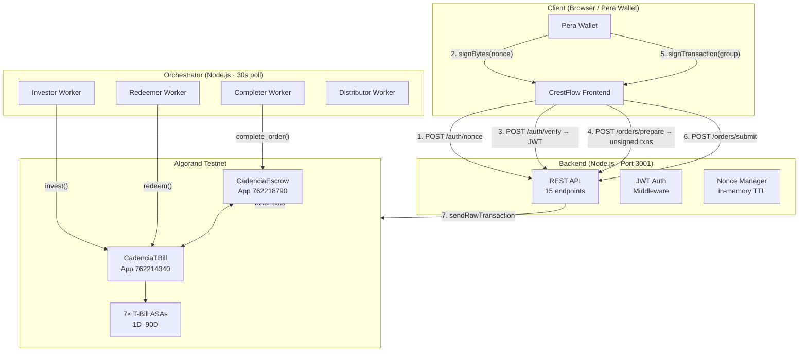
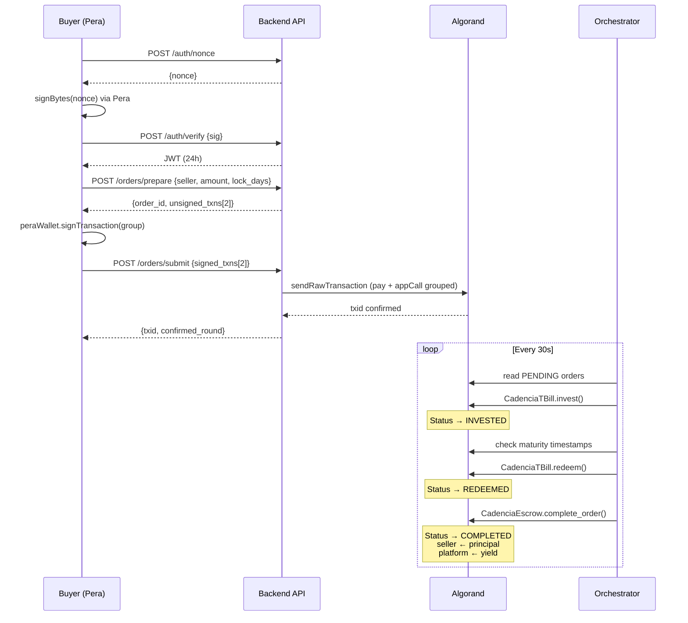
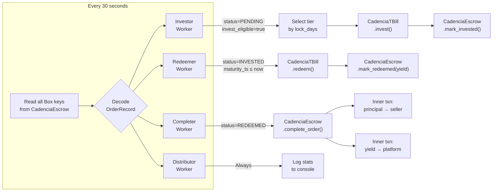
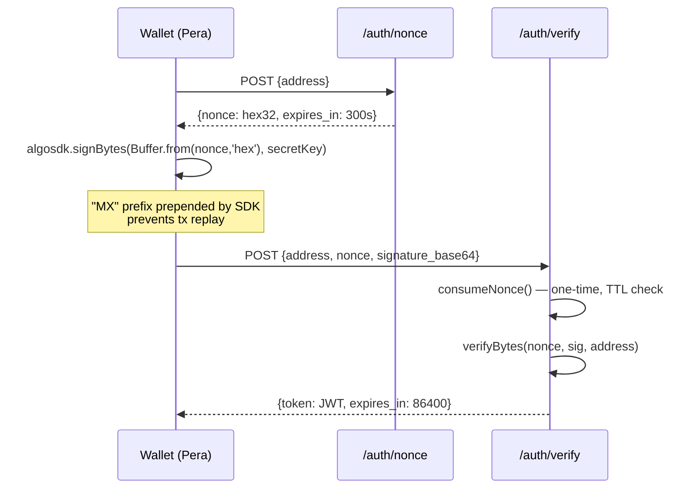
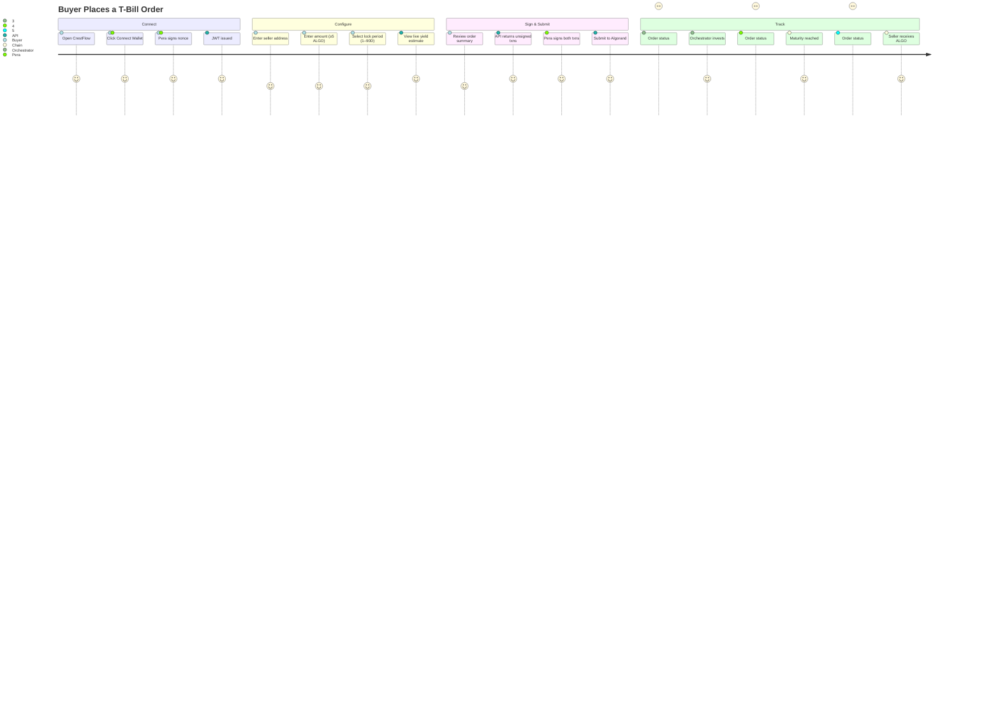
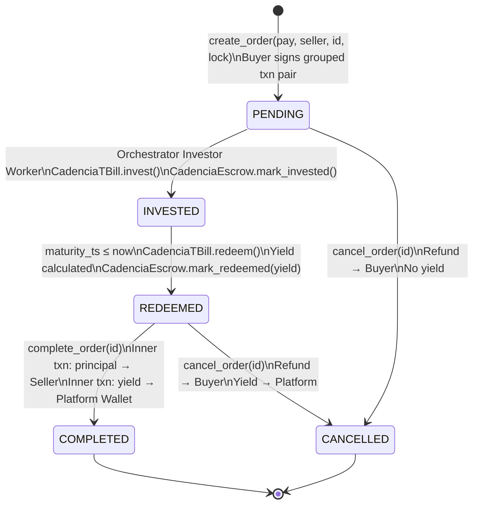

# CrestFlow Treasury

> **Non-custodial T-Bill yield engine on Algorand.** Idle escrow capital is automatically invested into tokenized short-term T-Bills during the lock period. Buyers and sellers are unaffected; all yield flows to the platform.

[](https://testnet.explorer.perawallet.app)
[](LICENSE)
[](backend/)
[](smart_contracts/)

---

## Table of Contents

1. [System Overview](#1-system-overview)
2. [Architecture](#2-architecture)
3. [Smart Contracts](#3-smart-contracts)
4. [Orchestrator](#4-orchestrator)
5. [Backend API](#5-backend-api)
6. [User Journeys](#6-user-journeys)
7. [Order Lifecycle](#7-order-lifecycle)
8. [Yield Model](#8-yield-model)
9. [Deployed Contracts](#9-deployed-contracts)
10. [Project Structure](#10-project-structure)
11. [Setup & Running](#11-setup--running)
12. [API Reference](#12-api-reference)
13. [Testing](#13-testing)
14. [Admin Access](#14-admin-access)

---

## 1. System Overview

CrestFlow sits as a treasury layer on top of any escrow-based marketplace. When a buyer locks ALGO for a seller, the funds would otherwise sit idle in escrow. CrestFlow automatically invests that capital into tokenized T-Bill instruments (on-chain ASAs) for the duration of the lock period, then redeems them at maturity and completes the order — sending principal to the seller and captured yield to the platform wallet.

**Key design properties:**

| Property | Implementation |
|---|---|
| Non-custodial | Auth via Ed25519 nonce signing; private keys never leave client |
| Trustless | All state transitions enforced by on-chain ARC-4 smart contracts |
| Autonomous | Orchestrator polls every 30s; no manual admin intervention required |
| Composable | REST API exposes every operation; plug any frontend or marketplace |
| Auditable | Every transition (invest, redeem, complete) is an on-chain transaction |

---

## 2. Architecture

### High-Level Component Map



### Data Flow Summary



---

## 3. Smart Contracts

Both contracts are written in **AlgoPy (Puya)** and compiled to ARC-4-compliant TEAL.

### 3.1 CadenciaEscrow

**Purpose:** Full order lifecycle management. Locks ALGO, tracks state, issues inner payment transactions on completion or cancellation.

**Box Storage:**

```
OrderRecord (98 bytes per order, keyed by "orders" + uint64 order_id)
├── buyer          arc4.Address   [0:32]
├── seller         arc4.Address   [32:64]
├── amount         arc4.UInt64    [64:72]   microALGO
├── created_at     arc4.UInt64    [72:80]   Unix timestamp
├── lock_until     arc4.UInt64    [80:88]   Unix timestamp
├── status         arc4.UInt8     [88:89]   0=PENDING 1=INVESTED 2=REDEEMED 3=COMPLETED 4=CANCELLED
├── invest_eligible arc4.Bool     [89:90]   MSB-encoded (0x80=True)
└── yield_earned   arc4.UInt64    [90:98]   microALGO
```

**ABI Methods (10 active):**

| Method | Auth | Description |
|---|---|---|
| `create_order(pay, seller, id, lock)` | Buyer | Lock ALGO, write OrderRecord |
| `mark_invested(id)` | Orchestrator | Status → INVESTED |
| `mark_redeemed(id, yield)` | Orchestrator | Status → REDEEMED, record yield |
| `complete_order(id)` | Admin/Orchestrator | Inner txns → seller + platform |
| `cancel_order(id)` | Admin | Inner txn → refund buyer |
| `get_order(id)` | Any | Read OrderRecord bytes |
| `get_escrow_stats()` | Any | Aggregate counters |
| `set_tbill_app(app_id, addr)` | Admin | Link TBill contract |
| `set_platform_wallet(addr)` | Admin | Yield destination |
| `set_min_order(amount)` | Admin | Min investment threshold |

### 3.2 CadenciaTBill

**Purpose:** Tokenized T-Bill issuance and maturity management. Holds ALGO reserves, tracks positions in Box storage, issues yield on redemption.

**Box Storage:**

```
TBillPosition (26 bytes per position, keyed by order_id uint64)
├── principal      arc4.UInt64    [0:8]    microALGO invested
├── maturity_ts    arc4.UInt64    [8:16]   Unix timestamp
└── asa_id         arc4.UInt64    [16:24]  Which T-Bill ASA
    status         arc4.UInt8     [24:25]  0=ACTIVE 1=REDEEMED
    reserved       arc4.UInt8     [25:26]
```

**Global State:**
- `yield_rate_bps` — 500 (5% APY)
- `demo_mode` — True (1 day = 60 seconds)
- `demo_multiplier` — 60
- `total_invested`, `total_yield_paid`, `active_positions`

**ABI Methods (8 active):**

| Method | Auth | Description |
|---|---|---|
| `invest(pay, order_id, tbill_asa, lock_days)` | Orchestrator | Record position, set maturity |
| `redeem(order_id)` | Orchestrator | Calculate yield, return ALGO+yield |
| `get_position(order_id)` | Any | Read TBillPosition bytes |
| `get_tbill_stats()` | Any | Aggregate counters |
| `create_tbill_asa(name, unit)` | Admin | Mint T-Bill ASA |
| `set_yield_rate(bps)` | Admin | Update APY |
| `set_demo_mode(enabled, multiplier)` | Admin | Toggle demo compression |
| `fund_reserve(pay)` | Admin | Add ALGO yield reserve |

---

## 4. Orchestrator

A Node.js/TypeScript service with 4 workers running on a 30-second poll cycle.

### Worker Pipeline



### Tier Selection Logic

```typescript
// orchestrator/src/workers/investor.ts
function selectTier(lockDays: number): { asaId: number; label: string } {
  if (lockDays >= 90) return TIERS['90D'];
  if (lockDays >= 60) return TIERS['60D'];
  if (lockDays >= 30) return TIERS['30D'];
  if (lockDays >= 14) return TIERS['14D'];
  if (lockDays >=  7) return TIERS['7D'];
  if (lockDays >=  3) return TIERS['3D'];
  return TIERS['1D'];
}
```

---

## 5. Backend API

Express.js REST API on port `3001`. Stateless except for an in-memory nonce store (TTL 5min).

### Authentication Tiers

| Tier | Who | How | Token Lifetime |
|---|---|---|---|
| **Buyer/Seller (Web3)** | Any wallet holder | Sign a 32-byte nonce with Pera Wallet → `POST /auth/verify` → JWT | 24 hours |
| **Admin (Web2)** | Platform operator only | Supabase email+password → Supabase JWT | Configurable |

**Response masking:** Public routes (`GET /orders`, `GET /orders/:id`) return safe fields only — `yield_earned`, `tbill_position`, and internal position data are omitted. An admin JWT on the same endpoints returns the full unmasked payload.

### Auth Flow (Non-Custodial)



---

## 6. User Journeys

### 6.1 Buyer Journey (Place an Order)



### 6.2 Seller Journey (Receive Payment)

The seller is entirely passive. They provide their Algorand address to the buyer (or to the parent marketplace), and receive the full principal automatically when the order completes. No wallet interaction, no platform registration, no transaction fees.

### 6.3 Platform Operator Journey

The platform operator:
1. Deploys contracts once via `scripts/deploy_*.py`
2. Runs the orchestrator (`npx ts-node src/index.ts`) — it handles all automation
3. Runs the backend API (`npx tsx src/index.ts`) — serves the frontend
4. Collects yield passively to `PLATFORM_WALLET_ADDRESS` on every order completion

---

## 7. Order Lifecycle



### Transaction Group (Order Creation)

Every new order submits an **atomic group of 2 transactions**:

```
Txn 0: pay
  sender:   buyer
  receiver: CadenciaEscrow address
  amount:   order_amount + fees (3000 µA flat)

Txn 1: appl (NoOp)
  sender:   buyer
  app_id:   ESCROW_APP_ID
  appArgs:  [create_order_selector, seller_bytes, order_id_uint64, lock_until_uint64]
  boxes:    [{appIndex: ESCROW_APP_ID, name: "orders" + order_id_uint64}]
```

Both must succeed atomically — if either fails, the whole group reverts.

---

## 8. Yield Model

### Formula

```
yield_µA = principal_µA × rate_bps × lock_days / 3,650,000
```

### Example Calculations (5% APY)

| Amount | Period | Yield (ALGO) | Total Return |
|---|---|---|---|
| 10 ALGO | 1 day | 0.00137 | 10.00137 |
| 10 ALGO | 7 days | 0.00959 | 10.00959 |
| 10 ALGO | 30 days | 0.04110 | 10.04110 |
| 10 ALGO | 90 days | 0.12329 | 10.12329 |
| 100 ALGO | 7 days | 0.09589 | 100.09589 |

### T-Bill Tiers

| Label | Lock Days | Demo Maturity | ASA ID |
|---|---|---|---|
| cTBILL-1D | 1 | 60 seconds | 762214378 |
| cTBILL-3D | 3 | 3 minutes | 762214379 |
| cTBILL-7D | 7 | 7 minutes | 762214380 |
| cTBILL-14D | 14 | 14 minutes | 762214381 |
| cTBILL-30D | 30 | 30 minutes | 762214389 |
| cTBILL-60D | 60 | 60 minutes | 762214390 |
| cTBILL-90D | 90 | 90 minutes | 762214391 |

> **Demo Mode:** Active on testnet. Maturity multiplier = 60s/day. Disable for mainnet.

---

## 9. Deployed Contracts

| Contract | App ID | Explorer |
|---|---|---|
| CadenciaEscrow | `762218790` | [View](https://testnet.explorer.perawallet.app/application/762218790) |
| CadenciaTBill | `762214340` | [View](https://testnet.explorer.perawallet.app/application/762214340) |

**Test Accounts:**
- Buyer: `CFZRI425PCKOE7PN3ICOQLFHXQMB2FLM45BYLEHXVLFHIQCU2NDCFKIHM4`
- Seller: `L22MEYNJK47WT3WWILMEBSRDSQJG6FMQMMMCBGQ6KBLHJK42FNVGUKWLE`

---

## 10. Project Structure

```
CrestFlow/
├── .env                              # Testnet config (App IDs, mnemonics)
├── .env.example                      # Template — copy and fill
├── .gitignore
├── pyproject.toml                    # Python project (crestflow-treasury)
├── pyrightconfig.json
├── requirements.txt
│
├── docs/
│   ├── FRONTEND_IMPLEMENTATION_PLAN.md   # Crestflow frontend spec (React/Lovable)
│   └── MAINNET_STRATEGY.md               # Revenue model and mainnet roadmap
│
├── smart_contracts/
│   ├── cadencia_escrow/
│   │   ├── contract.py               # Escrow ARC-4 contract (AlgoPy)
│   │   └── artifacts/cadencia_escrow/
│   │       ├── CadenciaEscrow.approval.teal
│   │       ├── CadenciaEscrow.clear.teal
│   │       └── CadenciaEscrow.arc56.json
│   └── cadencia_tbill/
│       ├── contract.py               # T-Bill ARC-4 contract (AlgoPy)
│       └── artifacts/cadencia_tbill/
│           ├── CadenciaTBill.approval.teal
│           ├── CadenciaTBill.clear.teal
│           └── CadenciaTBill.arc56.json
│
├── orchestrator/                     # Autonomous investment engine
│   ├── package.json
│   ├── tsconfig.json
│   └── src/
│       ├── config.ts                 # Env vars, Algod client, App IDs
│       ├── index.ts                  # Poll loop (30s interval)
│       ├── types.ts                  # Shared interfaces
│       ├── services/
│       │   ├── algorand.ts           # Algod client, payment helpers
│       │   ├── escrow.ts             # CadenciaEscrow ABI calls + Supabase sync
│       │   ├── tbill.ts              # CadenciaTBill ABI calls
│       │   ├── supabase.ts           # Supabase status sync (INVESTED/REDEEMED/COMPLETED)
│       │   └── yield-backend/
│       │       ├── interface.ts      # YieldBackend interface
│       │       ├── reserve.ts        # On-chain reserve (current/testnet)
│       │       ├── folks-finance.ts  # Folks Finance stub (mainnet Phase 2)
│       │       └── index.ts          # Backend factory (env-driven)
│       ├── workers/
│       │   ├── investor.ts           # PENDING → INVESTED
│       │   ├── redeemer.ts           # INVESTED → REDEEMED (on maturity)
│       │   ├── completer.ts          # REDEEMED → COMPLETED
│       │   └── distributor.ts        # Stats logging
│       └── utils/
│           ├── logger.ts
│           └── retry.ts
│
├── backend/                          # REST API
│   ├── package.json
│   ├── tsconfig.json
│   └── src/
│       ├── config.ts                 # Env vars, Algod client, tier config
│       ├── index.ts                  # Express app + /health + /tx/:txid
│       ├── middleware/
│       │   ├── jwt.ts                # requireAuth() — Web3 Bearer JWT
│       │   └── adminAuth.ts          # requireAdminAuth() — Supabase JWT
│       ├── routes/
│       │   ├── auth.ts               # POST /auth/nonce, /auth/verify
│       │   ├── orders.ts             # CRUD + prepare + submit (masked/unmasked)
│       │   ├── platform.ts           # Stats, config, tiers (admin-gated)
│       │   └── account.ts            # Balance, order history
│       └── services/
│           ├── chain.ts              # On-chain reads + Box decoding
│           ├── nonce.ts              # In-memory nonce TTL store
│           └── supabase.ts           # Supabase service-role client
│
└── scripts/
    ├── ops/                          # Deployment & admin tooling
    │   ├── deploy_escrow_v2.py       # Deploy CadenciaEscrow contract
    │   ├── deploy_tbill_v2.py        # Deploy CadenciaTBill + mint 7 ASAs
    │   └── relink_escrow.py          # Re-link Escrow → TBill after redeploy
    ├── test_full_flow.py             # ★ Primary E2E test (37 checks, all pass)
    ├── test_system_e2e.py            # Parallel suite: API + Chain + Supabase
    └── test_supabase_e2e.py          # Supabase schema, RLS, FK integrity
```

---

## 11. Setup & Running

### Prerequisites

- Python 3.12+
- Node.js 18+
- AlgoKit CLI 2.10.2+

### 1. Clone & Install

```bash
git clone https://github.com/AdityaWagh19/CrestFlow.git
cd CrestFlow

# Python deps (for scripts and contract compilation)
pip install -r requirements.txt

# Orchestrator
cd orchestrator && npm install && cd ..

# Backend API
cd backend && npm install && cd ..
```

### 2. Configure Environment

```bash
cp .env.example .env
# Fill in DEPLOYER_MNEMONIC and ORCHESTRATOR_MNEMONIC
# App IDs and ASA IDs are pre-populated for the current testnet deployment
```

### 3. Run (Two Terminals)

**Terminal 1 — Orchestrator**
```bash
cd orchestrator
npx ts-node src/index.ts
```

**Terminal 2 — Backend API**
```bash
cd backend
npx tsx watch src/index.ts
# API available at http://localhost:3001
```

### 4. Compile Contracts (only if modifying source)

```bash
algokit compile python smart_contracts/cadencia_escrow/contract.py \
  --out-dir smart_contracts/cadencia_escrow/artifacts/cadencia_escrow

algokit compile python smart_contracts/cadencia_tbill/contract.py \
  --out-dir smart_contracts/cadencia_tbill/artifacts/cadencia_tbill
```

---

## 12. API Reference

All endpoints served at `http://localhost:3001`. JWT required endpoints need `Authorization: Bearer <token>`.

### Auth

| Method | Path | Auth | Description |
|---|---|---|---|
| POST | `/auth/nonce` | — | Issue 32-byte hex nonce (TTL 5min) |
| POST | `/auth/verify` | — | Verify Ed25519 sig → JWT (24h) |

### Orders

| Method | Path | Auth | Description |
|---|---|---|---|
| GET | `/orders` | — | List orders (`?status=&buyer=&seller=&limit=&offset=`) |
| GET | `/orders/estimate` | — | Yield preview (`?amount_algo=&lock_days=`) |
| GET | `/orders/:id` | — | Order + T-Bill position + lifecycle state |
| POST | `/orders/prepare` | JWT | Build unsigned grouped txns for client signing |
| POST | `/orders/submit` | JWT | Submit signed txns, returns confirmed txid |
| DELETE | `/orders/:id` | JWT | Cancel order (refund buyer) |

### Platform

| Method | Path | Auth | Description |
|---|---|---|---|
| GET | `/platform/stats` | Admin JWT | Live on-chain aggregate stats |
| GET | `/platform/config` | Admin JWT | Contract IDs, ASA IDs, network |
| GET | `/platform/tiers` | Admin JWT | All 7 tiers with APY and demo maturity |
| GET | `/platform/history` | Admin JWT | Historical platform snapshots |

### Account

| Method | Path | Auth | Description |
|---|---|---|---|
| GET | `/account/:address` | — | Wallet balance, assets, opted-in apps |
| GET | `/account/:address/orders` | — | Order history (`?role=buyer\|seller\|any`) |

### Misc

| Method | Path | Auth | Description |
|---|---|---|---|
| GET | `/tx/:txid` | — | Transaction confirmation status |
| GET | `/health` | — | Server + network health check |

### Key Response Shapes

**`GET /orders/:id`**
```json
{
  "order_id": 589631,
  "buyer": "CFZR...HM4",
  "seller": "L22M...WLE",
  "amount_algo": 10,
  "status": "COMPLETED",
  "invest_eligible": true,
  "yield_earned_algo": 0.001369,
  "tbill_position": {
    "principal_algo": 10,
    "tbill_label": "cTBILL-1D",
    "maturity_iso": "2026-05-12T12:42:12Z",
    "status": "REDEEMED",
    "is_matured": true,
    "seconds_until_maturity": 0
  },
  "lifecycle": { "is_active": false, "is_complete": true },
  "links": {
    "buyer_explorer": "https://testnet.explorer.perawallet.app/address/CFZR...",
    "escrow_explorer": "https://testnet.explorer.perawallet.app/application/762218790"
  }
}
```

**`POST /orders/prepare`** request:
```json
{ "seller_address": "L22M...WLE", "amount_algo": 10, "lock_days": 7 }
```
Response includes `order_id`, `unsigned_txns: [base64, base64]`, and `signing_instructions`.

---

## 13. Testing

Three test scripts cover different layers. Requires backend + orchestrator running on testnet.

### Test Suite Overview

| Script | What it covers | Checks | When to run |
|---|---|---|---|
| `test_full_flow.py` | Full lifecycle E2E: Auth → Prepare → Sign → Submit → Invest → Redeem → Complete → Supabase sync | **37** | Before every deploy |
| `test_system_e2e.py` | API endpoints + Algorand chain + Supabase DB (parallel) | **63** | CI/CD baseline |
| `test_supabase_e2e.py` | All 8 tables, RLS policies, FK integrity, views | **50+** | After schema migrations |

### Primary E2E Test — `test_full_flow.py`

Runs the complete lifecycle against live testnet in ~5 minutes.

```bash
# 1-day tier (fastest — ~5 min total)
python scripts/test_full_flow.py --tier 1 --amount 10

# With admin unmasking test (requires Supabase admin password)
python scripts/test_full_flow.py --tier 1 --amount 10 --admin-password <password>
```

**Latest verified output:**
```
  STEP 1: Backend health check         [PASS] GET /health → 200
  STEP 2: Buyer auth — nonce → JWT     [PASS] POST /auth/verify → JWT (223 chars)
  STEP 3: Yield estimate               [PASS] Est. yield: 0.00137 ALGO  |  APY: 5%
  STEP 4: Prepare unsigned txns        [PASS] 2 unsigned txns returned
  STEP 5: Sign & submit                [PASS] txid confirmed on-chain
  STEP 6: Public masked view           [PASS] No yield_earned / tbill_position exposed
  STEP 7: Wait for INVESTED            [PASS] Order reached INVESTED
  STEP 8: Wait for COMPLETED           [PASS] Order reached COMPLETED
  STEP 9: On-chain balance change      [PASS] Seller received ~10 ALGO
  STEP 10: Admin unmasked endpoint     [PASS] Full data visible with admin JWT
  STEP 11: Public mask after complete  [PASS] yield_earned still hidden publicly
  STEP 12: Unauthenticated platform    [PASS] No token → 401  |  Bad token → 401

  ALL 37 CHECKS PASSED ✓

  TxID: G7VHAUXXV24MU2EIKXAW2YMSWCSFPOWPHYNC6YZHLHGKOUZG7KDQ
```

### Parallel System Test — `test_system_e2e.py`

```bash
python scripts/test_system_e2e.py
```

Runs 63 checks across three suites in parallel: REST API contract, Algorand chain reads, and Supabase DB writes.

### Supabase Schema Test — `test_supabase_e2e.py`

```bash
python scripts/test_supabase_e2e.py
```

Verifies all 8 tables (`orders`, `tbill_positions`, `tx_events`, `wallets`, `nonces`, `platform_snapshots`, `orchestrator_logs`, `notifications`), RLS policies (anon cannot write/read protected tables), FK cascade integrity, and the `order_summary` view.

---

## 14. Admin Access

Admin routes are protected by **Supabase JWT** (email/password auth, separate from the Web3 wallet flow).

### Admin-Only Routes

| Route | Access Level |
|---|---|
| `GET /platform/stats` | Admin only |
| `GET /platform/config` | Admin only |
| `GET /platform/tiers` | Admin only |
| `GET /platform/history` | Admin only |

### Admin-Enhanced Routes (public with partial data, full with admin JWT)

| Route | Public | Admin |
|---|---|---|
| `GET /orders` | `order_id, status, buyer, seller, amount_algo, lock_until` | + `yield_earned`, `status_code`, `invest_eligible` |
| `GET /orders/:id` | Above fields + `description`, `lifecycle`, `links` | + `tbill_position`, `yield_earned_algo`, `tbill_explorer` |

### Required Environment Variables

```bash
ADMIN_EMAIL=your-admin@email.com       # Must match Supabase user
SUPABASE_JWT_SECRET=your-jwt-secret    # From Supabase → Settings → API
SUPABASE_URL=https://xxx.supabase.co
SUPABASE_SERVICE_ROLE_KEY=...          # Service role (backend only)
SUPABASE_ANON_KEY=...                  # Anon key
```

---

## Mainnet Considerations

See [`docs/MAINNET_STRATEGY.md`](docs/MAINNET_STRATEGY.md) for the full revenue model, yield source options (Folks Finance, institutional T-bill custodians), and deployment roadmap.

The `NETWORK` environment variable (`testnet` | `mainnet`) is the single flip switch. The `YIELD_BACKEND` variable (`reserve` | `folks-finance`) selects the yield source. No code changes required at flip time — only `.env` updates.

---

## Frontend

See [`docs/FRONTEND_IMPLEMENTATION_PLAN.md`](docs/FRONTEND_IMPLEMENTATION_PLAN.md) for the complete Crestflow React frontend spec including design system, all 7 pages, 12 shared components, Pera Wallet integration, and Lovable build instructions.

---

## License

MIT — see [LICENSE](LICENSE).
